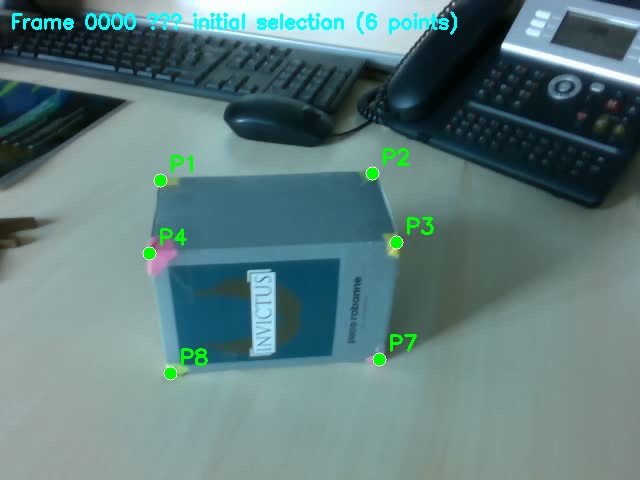
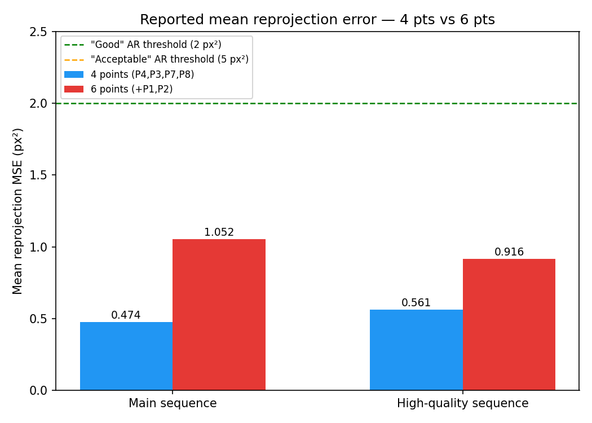
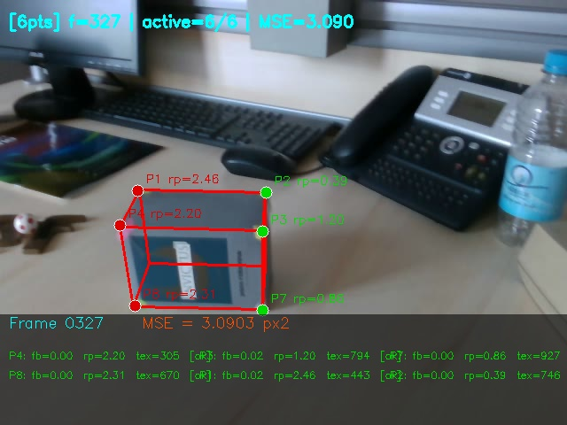
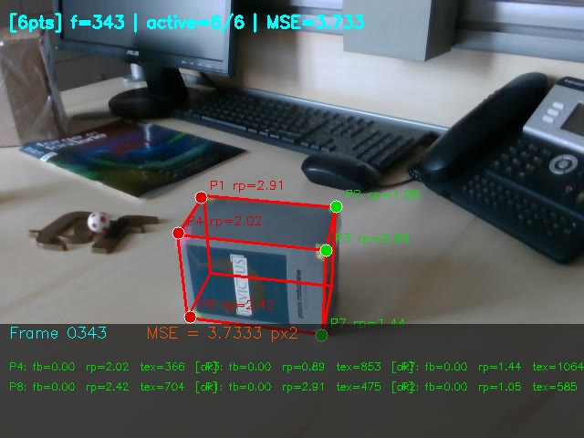

# KLT Tracking + PnP Pose Estimation — 3D Box Tracking

Real-time 6-DoF pose estimation of a rigid box from a single monocular camera, combining **KLT optical-flow tracking**, **PnP pose estimation**, and a **dynamic outlier-exclusion mechanism** to keep the pose stable as tracked points become unreliable.

<p align="center">
  
  <br><em>Frame 0 — manual initialization of the 6 tracked corners on the box.</em>
</p>

## Pipeline

```
Frame t                                          Frame t+1
   │                                                  │
   ├── KLT optical flow (forward) ───────────────────►│
   │   + backward re-projection check                 │
   │   (rejects silent drift that status=1 misses)     │
   │                                                   │
   ├── Local texture variance check ──────────────────┤
   │   (rejects points in flat/low-gradient regions)   │
   │                                                   │
   ├── solvePnP (iterative, warm-started) ─────────────┤
   │   → rvec, tvec                                    │
   │                                                   │
   ├── Per-point reprojection error ───────────────────┤
   │   → dynamic exclusion / re-integration mask        │
   │                                                   │
   ├── Second solvePnP on active inliers only ─────────┤
   │   → refined pose                                  │
   │                                                   │
   └── Project 3D box wireframe onto the frame ────────┘
```

## Why this is more than a basic KLT+PnP demo

- **Forward-backward KLT check**: a point is only trusted if propagating it forward then back lands within 1 px of its original position — OpenCV's own `status` flag misses this kind of silent drift.
- **Texture-variance gating**: KLT needs local image gradients to converge; points in flat, low-contrast regions are flagged unreliable before they corrupt the pose.
- **Dynamic exclusion / re-integration**: after each `solvePnP` call, every point's individual reprojection error is checked. Points above threshold are excluded from the *next* pose estimate; excluded points are silently re-tested every frame and reintegrated once their (re-projected) position becomes reliable again — without ever needing to re-click anything.
- **Two-pass PnP per frame**: an initial pose from all "usable" points, then a refined second pass restricted to the points that actually proved reliable *for that pose* — this is what keeps the wireframe locked onto the box even when 1–2 of the 6 tracked corners are temporarily bad.

## Results (reported on the provided sequence)

| Configuration | Main sequence — mean MSE | High-quality sequence — mean MSE |
|---|---|---|
| **4 points** (front face: P3, P4, P7, P8) | 0.474 px² | 0.561 px² |
| **6 points** (+ P1, P2 on the rear-top face) | 1.052 px² | 0.916 px² |

<p align="center">
  
</p>

Both configurations stay well under the 2 px² "good" threshold used in the augmented-reality literature (5 px² is generally considered "acceptable"). The 4-point configuration is consistently more precise on this sequence: its 4 corners belong to the well-lit, high-contrast front face and remain reliably trackable throughout. The 6-point configuration adds two corners on the rear-top face — this face becomes partially occluded as the camera angle changes later in the sequence, so points **P1**, **P4**, and **P8** develop reprojection errors above 2 px around frames 327–343 (see below), pulling the mean MSE up despite the extra geometric redundancy.

<p align="center">
  
  
  <br><em>Diagnostic frames 327 and 343 — red points show individual reprojection error above the 2 px exclusion threshold, triggering the dynamic-exclusion mechanism described above.</em>
</p>

**Trade-off**: on this specific sequence, 4 points is more accurate on average; 6 points is more *robust* to momentary tracking loss on any single corner, since 2 spare correspondences keep the minimum of 4 needed for PnP even if one of the "core" 4 points briefly fails.

## Point color legend (debug frames)

| Color | Meaning |
|---|---|
| 🟢 Green | Tracked correctly, reprojection error OK |
| 🟠 Orange | KLT forward-backward check failed (drift detected) |
| 🟡 Yellow | Low local texture — KLT tracking considered unreliable |
| 🔴 Red | High reprojection error (≥ 2 px) or excluded from PnP |

## Files

```
KLT_PNP.py                        Full pipeline (single file, ~430 lines)
box_video_data.avi                Source video (351 frames, 640x480, 11 fps)
docs/debug_frames_sample/         Sample of annotated diagnostic frames from an actual run
docs/mse_comparison.png           Reported mean-MSE comparison, 4pts vs 6pts
```

The full diagnostic set (131 frames covering frame 0, every frame from 300 onward, and every frame where any point's reprojection error exceeded 2 px) is generated automatically by the script itself — only a representative subset is kept in this repository.

## How to run

```bash
pip install opencv-python numpy matplotlib
python3 KLT_PNP.py
```

The script opens the first frame and asks you to click the tracked corners **in order** (4 points, then 6 points for the second run); press **ENTER** to confirm each set. It then plays back the tracking live, writes an augmented video (`augmented_4pts.avi` / `augmented_6pts.avi`) with the projected 3D wireframe overlaid, and finally saves `eqm_comparison.png` — a live-generated version of the comparison plot shown above.

> **Note on reproducibility**: point initialization is a manual mouse-click step by design (this mirrors how markerless AR trackers are typically bootstrapped), so results aren't produced by an automated headless run — the numbers and frames above come directly from an actual recorded session with this code.

## Camera model

A fixed pinhole camera model is used throughout (intrinsics calibrated beforehand, zero distortion assumed):

```
fx = 606.209   fy = 606.719
cx = 320.046   cy = 238.926
```

The tracked object is a rigid box (125 × 90 × 70 mm), with its 8 corners defined in a local 3D frame and a subset of 4 or 6 of them tracked per run.

## License

MIT — see the root [LICENSE](../LICENSE).
